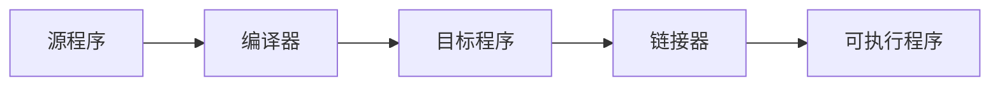

## C++的应用领域

* 大型桌面应用
    * Adobe Photoshop
    * Google Chrome
    * Microsoft office
* 大型网站后台
    * 搜索引擎
* 大型游戏后台
    * 王者荣耀
* 大型游戏引擎
    * Unreal/ Unity
* 编译器/ 解释器
    * LLVM/ ClangGCC
    * Java 虚拟机
    * JavaScript 引擎
* 视觉和只能引擎
    * OpenCV
    * TensorFlow
* 数据库
    * Microsoft SQL Server
    * MongoDB
* 自动驾驶
* 嵌入式设备


## C，C++ 发展历史

* C++ 编程语言的历史可追溯到1979，`Bjarne Stroustrup` 创立了带类的C。顾名思义，这就是C语言的超集; 1983年，语言的名字正式改为 C++

* C++ 在最开始可以称作是C语言的增强版，但在后来，C++又引入了很多新的功能，逐步增强了C++的可用性。1998年伴随着STL标准库的诞生，一堆新的功能和特性的产生，C++标准委员会发布了第一个国际标准C++ +ISO/IES 1488: 简称 `C++ 98`

* 在 2011年中期，C++标准（C++ 11）完成了新的标准。Boost库项目对新标准产生了相当大的影响，一些新模块直接从相应的Boost库中派生出来。
* C++ 11 之后，C++ 以每三年一版本的频率发布新的语言标准，每一版都基本保留向后兼容的同时，提供着改进和新的功能。


## C++ 的特点

* 优点
    * `强大的抽象封装能力`: 这让C++语言具备了强大的开发工程能力，在封装的同时C++最大程度的保留了高性能。
    * `高性能`: 运行快，占用的资源少
    * `低功耗`: 特别适合在各种微型的嵌入式设备中运行高效的程序
* 缺点
    * `语法相对复杂`: 细节比较多，学习曲线比较陡
    * `需要一些好的规范`: 否则代码难以维护


## C++ 基础语法

### 编程语言的层次和类型

<p class="warn">从上到下，使用层次更接近于人类使用，但运行效率逐渐降低。</p>

* 机器语言(Machine), 汇编(Assembly)语言
* 编译型语言, C, C++ 等
* 解释型语言, Basic, Python 等
* 脚本语言, Bash, csh 等


`编译形语言` 一般需要经历编译和链接的过程，才能编程真正可执行的程序。



### C++ 数据类型

<p class="tip">C++ 中每个变量都有其数据类型，数据类型决定这个变量所占内存空间的大小和布局方式、该空间能存储的值的范围，以及变量能参与的运算。</p>


| 名称              | 字节数(byte = 8 bits) | 描述                                                         | 范围                                                       |
| ----------------- | --------------------- | ------------------------------------------------------------ | ---------------------------------------------------------- |
| char              | 1                     | character or integer                                         | signed: -128 - 127<br />unsigned: 0 - 255                  |
| short int (short) | 2                     | 16 bits short integer                                        | signed: -32768 - 32767<br />unsigned: 0 - 65535            |
| long int (long)   | 4                     | 32 bits long integer                                         | signed: -2147483648 - 2147483647<br />unsigned: 4294967295 |
| int               | 4                     | integer                                                      | signed: -2147483648 - 2147483647<br />unsigned: 4294967295 |
| float             | 4                     | floating point number                                        | 3.4e + / - 38 (7 digits)                                   |
| double            | 8                     | double precision floating point number                       | 1.7e + / - 308 (15 digits)                                 |
| long double       | 8                     | long double precision floating point number                  | 1.7e + / - 308 (15 digits)                                 |
| bool              | 1                     | Boolean value                                                | true / false                                               |
| wchar_t           | 2                     | Wide character - 这是为存储两字节长(2 bytes) 的国际字符而设计的类型 | 1 wide characters                                          |


### 常见数据类型的定义

```c++
char a[10] = "a";
short int s = 97;
int m = 97;
long int n = 97;
float f = 97.0f;
double d = 97.0;
long double k = 97.0;
bool b = true;
wchar_t w[10] = L"a";
```


### 变量

* 变量: 在程序运行过程中，其值可以改变的量为变量
* 变量在程序的执行过程中能够赋值，发生改变
* 变量有一个名字，并在使用之前要说明其类型，一经说明，就在内存中占据与其类型相应的存储单元
* 当变量在创建时获得了一个特定的值，我们说这个变量被初始化了。用于初始化变量的值可以是任意复杂的表达式。

```c++
// 变量的定义
int m = 1, n = 1;
```


### 常量

* 常量: 在程序运行过程中，其值一直保持不变的量为常量；
* 尽量使用 `const` 关键字俩定义变量
* `#define` 在编译期出错时，很难排除错误

```c++
// 常量的定义
// 1. 使用 #define
#define PI 3.1415926

// 2. 使用 const 关键字
const double PI - 3.1415926;
```


#### 整数常量

* 整数常量可以是十进制，八进制或十六进制

* 前缀指定基数: 0x 或 0X 表示十六进制，0表示八进制，不带前缀则默认表示十进制

* 整数常量也可以带一个后缀，后缀是`U` 和 `L`的组合

    * U 表示无符号整数 (Unsigned)
    * L 表示长整数 (Long)
    * 后缀可以是大写也可以是小写
    * U和L的顺序任意

    

#### 布尔常数

* true / false


#### 字符常量

* 字符常量是括在单引号中。如果常量以 L 开头，则表示它是一个宽字符常量 (L'x'), 此时它必须存储在 wchar_t 类型的变量中。否则，它就是一个窄字符常量 ('x'), 此时它可以存储在 char 类型的简单变量中
* 字符常量可以是一个普通的字符 ('x')， 一个转义序列 ('\\t')， 或一个通用的字符 ('\u02C0')

| 字符常量 | 含义                       |
| -------- | -------------------------- |
| \\\\     | \\ 字符                    |
| \\'      | ' 字符                     |
| \\"      | " 字符                     |
| \\?      | ? 字符                     |
| \\a      | 警报铃声                   |
| \\b      | 退格符                     |
| \\f      | 换页符                     |
| \\n      | 换行符                     |
| \\r      | 回车                       |
| \t       | 水平制表符                 |
| \v       | 垂直制表符                 |
| \ooo     | 一到三位的八进制数         |
| \xhh     | 一个或多个数字的十六进制数 |

