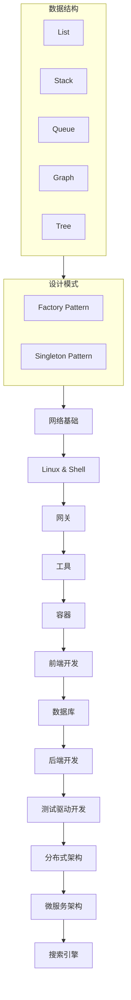

# Roadmap Guidance

```mermaid
flowchart TD
    数据结构 -->
    设计模式 --> 
    网络基础 -->
    linux[Linux & Shell] -->
    网关 -->
    工具 -->
    容器 -->
    前端开发 -->
    数据库 -->
    后端开发 -->
    测试驱动开发 -->
    分布式架构 -->
    微服务架构 -->
    搜索引擎
    
    
subgraph 设计模式
	factory_pattern[Factory Pattern]
	singleton_pattern[Singleton Pattern]
end

subgraph 数据结构
	List
	Stack
	Queue
	Graph
	Tree
end
```

